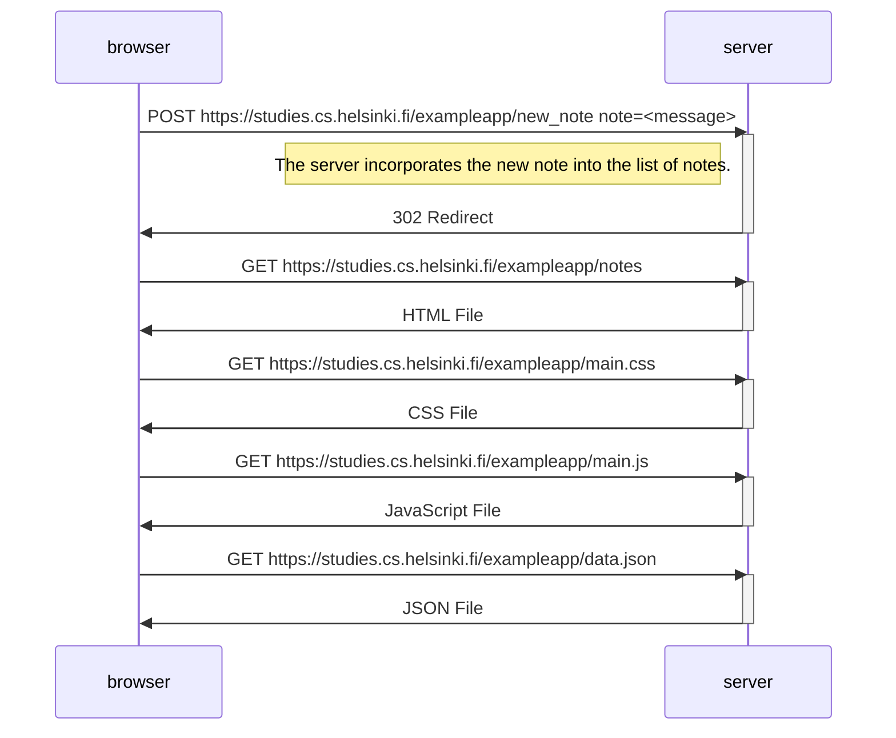

```mermaid
sequenceDiagram

browser->>server: POST https://studies.cs.helsinki.fi/exampleapp/new_note note=<message>
activate server
Note left of server: The server incorporates the new note into the list of notes.
server->>browser: 302 Redirect
deactivate server

browser->>server: GET https://studies.cs.helsinki.fi/exampleapp/notes
activate server
server->>browser: HTML File
deactivate server

browser->>server: GET https://studies.cs.helsinki.fi/exampleapp/main.css
activate server
server->>browser: CSS File
deactivate server

browser->>server: GET https://studies.cs.helsinki.fi/exampleapp/main.js
activate server
server->>browser: JavaScript File
deactivate server

browser->>server: GET https://studies.cs.helsinki.fi/exampleapp/data.json
activate server
server->>browser: JSON File
deactivate server
```