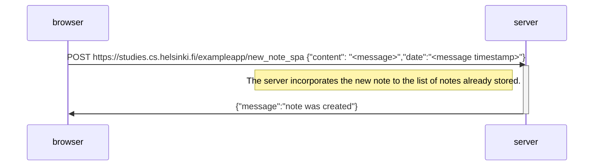

```mermaid
sequenceDiagram

browser->>server: POST https://studies.cs.helsinki.fi/exampleapp/new_note_spa {"content": "<message>","date":"<message timestamp>"}
activate server
Note left of server: The server incorporates the new note to the list of notes already stored.
server->>browser: {"message":"note was created"}
deactivate server
```